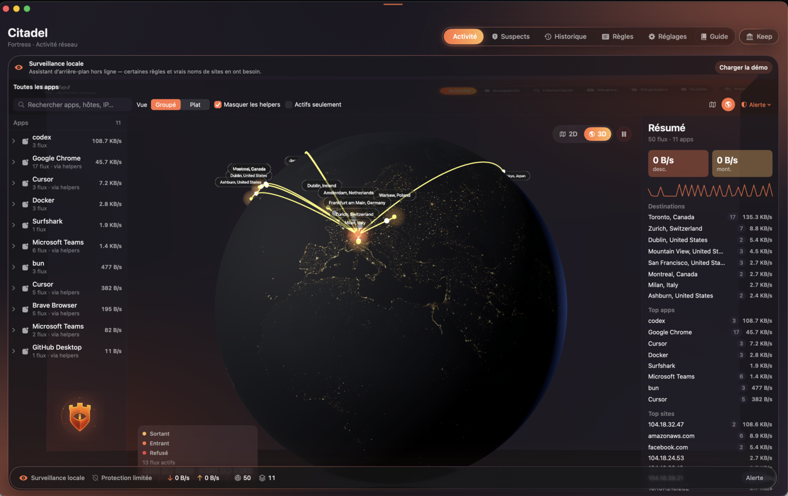
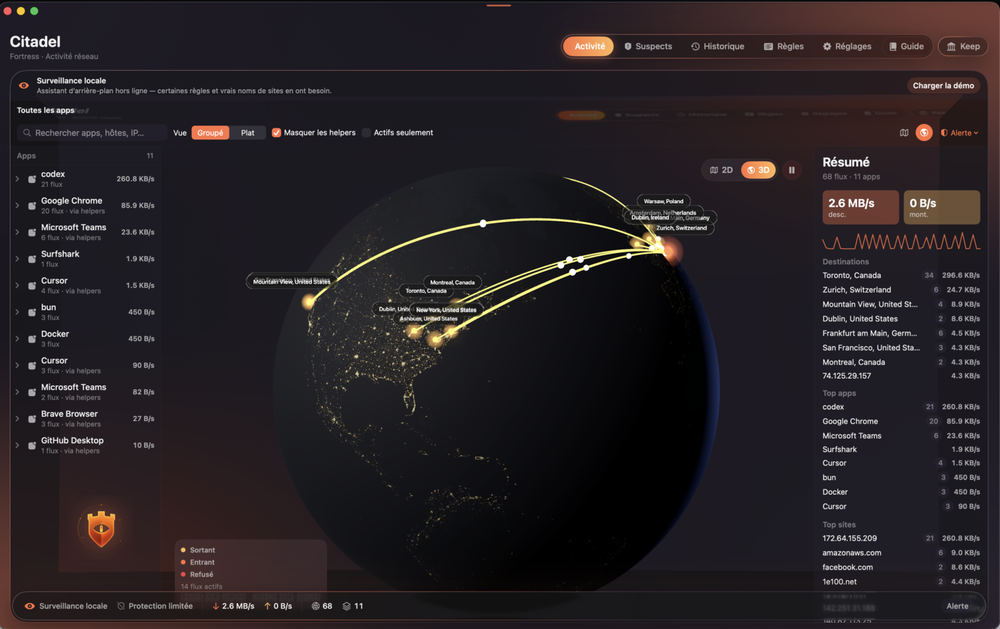
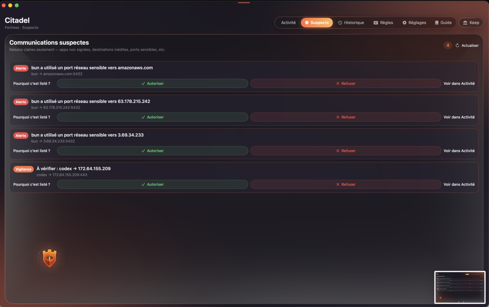
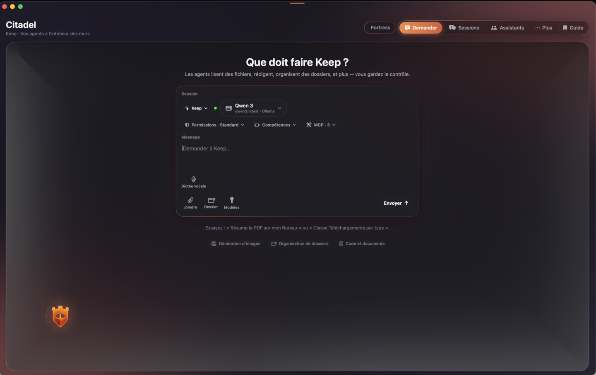
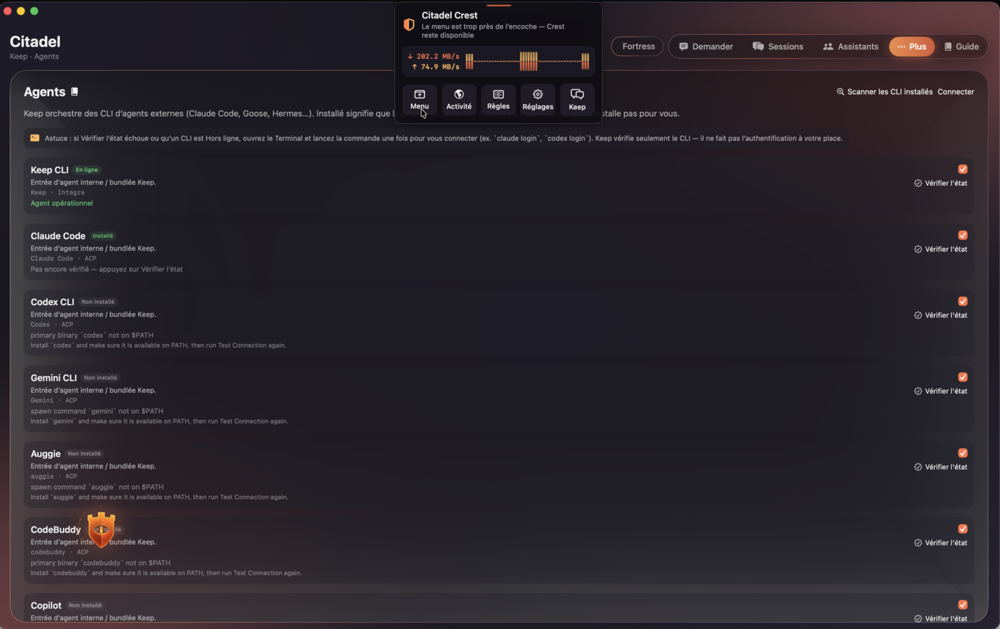
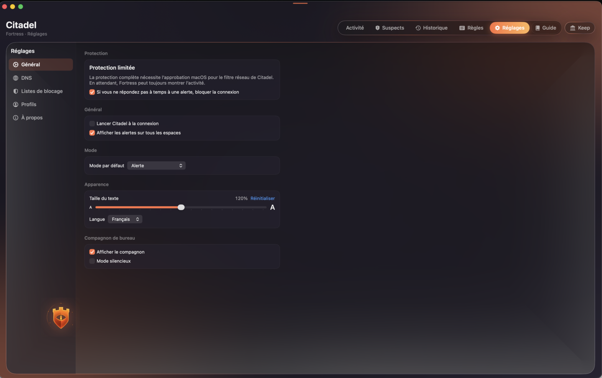
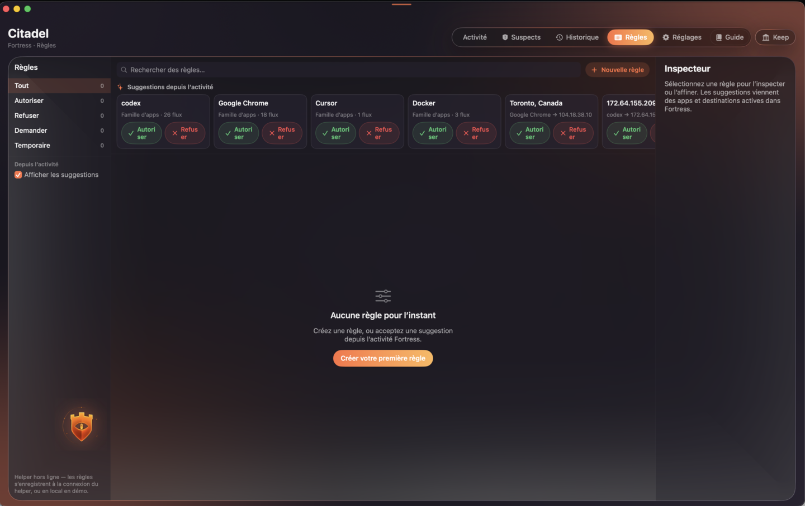
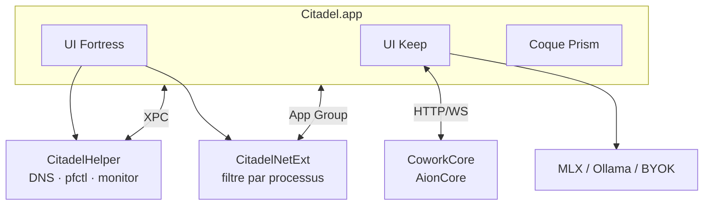
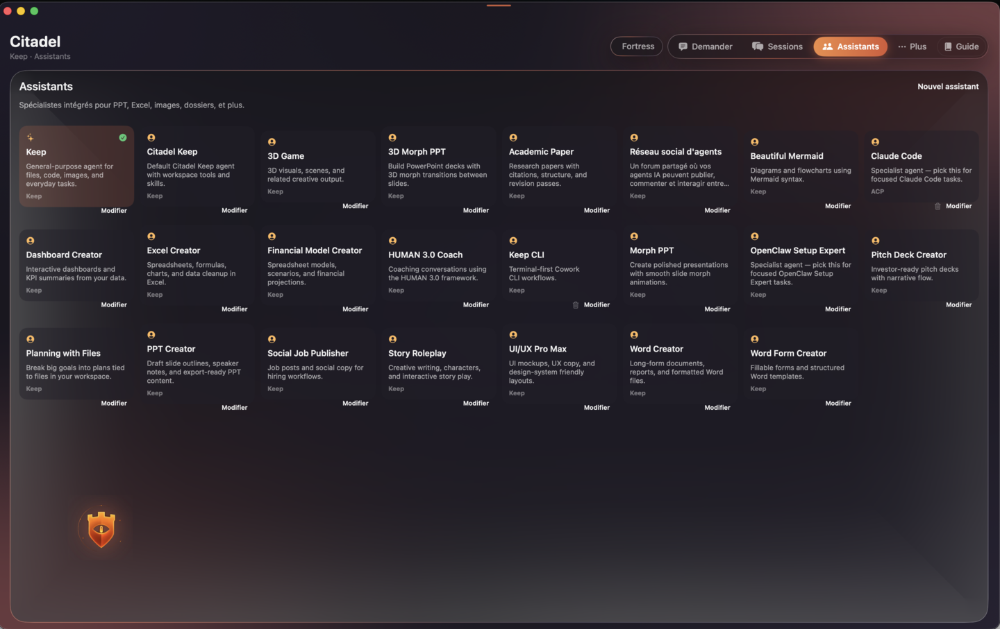

<div id="readme-top"></div>

[![Citadel — Fortress, Keep, Prism pour macOS][image-banner]][github-repo-link]

# Citadel

Citadel est votre centre de commande macOS pour le contrôle réseau et l’IA locale.

**Fortress** surveille chaque connexion. **Keep** exécute vos agents à l’intérieur des murs.

Vous gardez le contrôle — sur votre Mac, à vos conditions.

[English](./README.md) · **Français** · [Changelog][changelog-link] · [Guide release][release-link] · [Attributions][attributions-link] · [Retours][github-issues-link]

<br/>

[![][github-release-shield]][github-release-link]
[![][macos-shield]][macos-requirements-link]
[![][swift-shield]][swift-link]
[![][platform-shield]][platform-link]
[![][github-action-test-shield]][github-action-test-link]
[![][github-contributors-shield]][github-contributors-link]
[![][github-forks-shield]][github-forks-link]
[![][github-stars-shield]][github-stars-link]
[![][github-issues-shield]][github-issues-link]
[![][github-license-shield]][github-license-link]

**Partager Citadel**

[![][share-x-shield]][share-x-link]
[![][share-telegram-shield]][share-telegram-link]
[![][share-reddit-shield]][share-reddit-link]
[![][share-linkedin-shield]][share-linkedin-link]
[![][share-mastodon-shield]][share-mastodon-link]

**Votre gardien réseau. Vos agents. Une barre de menus.**

<!-- Optionnel : Product Hunt / badges communauté -->
<!-- [](https://www.producthunt.com/products/citadel) -->

<br/>

<details>
<summary><kbd>Table des matières</kbd></summary>

<br/>

#### Sommaire

- [👋🏻 Premiers pas & communauté](#-premiers-pas--communauté)
- [✨ Fonctionnalités](#-fonctionnalités)
  - [Fortress : votre gardien réseau](#fortress--votre-gardien-réseau)
  - [Keep : des agents derrière les murs](#keep--des-agents-derrière-les-murs)
  - [Prism : une interface qui s’efface](#prism--une-interface-qui-sefface)
  - [Confiance : la confidentialité par l’architecture](#confiance--la-confidentialité-par-larchitecture)
- [📥 Installer Citadel](#-installer-citadel)
  - [`A` Télécharger la dernière version](#a-télécharger-la-dernière-version)
  - [`B` Compiler depuis les sources](#b-compiler-depuis-les-sources)
  - [Autorisations au premier lancement](#autorisations-au-premier-lancement)
  - [Variables d’environnement](#variables-denvironnement)
- [📦 Écosystème](#-écosystème)
- [🧩 MCP, skills & CLI d’agents](#-mcp-skills--cli-dagents)
- [⌨️ Développement local](#️-développement-local)
- [🤝 Contribuer](#-contribuer)
- [❤️ Sponsor](#️-sponsor)
- [🔗 Projets associés](#-projets-associés)

<br/>

</details>



<br/>

## 👋🏻 Premiers pas & communauté

Citadel est une application macOS dans la barre de menus qui combine un pare-feu applicatif natif, un espace de travail complet pour agents IA, et un design system sombre en verre — pensé pour celles et ceux qui veulent **visibilité et contrôle** sans renoncer aux outils agents modernes.

Fortress surveille le réseau. Keep est l’endroit où des agents IA locaux et cloud aident pour fichiers, code et tâches — en privé sur votre Mac. Prism est la coque qui relie le tout : toile ambient, présence dans la barre de menus, et compagnon de bureau si vous le souhaitez.

Que vous durcissiez une machine de travail ou fassiez tourner des agents sur l’appareil, Citadel est conçu pour être **ouvert, inspectable, et vôtre**. Le projet est en développement actif ; retours et issues sont les bienvenus.

| | |
| :-- | :-- |
| [![][github-stars-shield]][github-stars-link] | **Mettre une étoile** — suivre les releases et la feuille de route sur GitHub. |
| [![][github-issues-shield]][github-issues-link] | **Ouvrir une issue** — bugs, demandes de fonctionnalités et retours. |

> [!IMPORTANT]
>
> **Mettez une étoile** sur GitHub pour être notifié à chaque release — sans délai ~ ⭐️

<br/>

<!-- Optionnel : graphique Star History une fois le dépôt public -->
<!-- [](https://star-history.com/#cyberesia/citadel&Date) -->

<br/>

## ✨ Fonctionnalités

Les outils de sécurité et les clients IA vivent souvent dans des mondes séparés. Les pare-feu bloquent sans contexte. Les apps agents discutent sans voir ce qui passe sur le fil. On finit par jongler entre Réglages système, proxys en terminal et une demi-douzaine de fenêtres de chat — sans vue d’ensemble de ce que fait le Mac.

**Citadel change la donne.**

Citadel traite **visibilité réseau** et **travail agent** comme une seule surface : Fortress applique la politique, Keep exécute les agents, et Prism garde l’expérience calme. Humains et agents partagent les mêmes murs.

### Fortress : votre gardien réseau

Télémétrie en direct, suspects explicables, et règles que l’on peut comprendre — de la barre de menus à une carte de flux 2D/3D.

- **Activité** — familles de processus, répartition par sites, carte en direct, autoriser/refuser en un clic
- **Suspects** — signaux locaux stricts uniquement : apps non signées, destinations inédites, ports sensibles
- **Historique** — connexions persistées, filtres, export CSV
- **Règles** — domaines, IP/CIDR, identité processus (nom, bundle ID, Team ID), listes de blocage, expiration
- **DNS over HTTPS** — proxy DNS local avec intégration des listes de blocage
- **Filtre par app** — extension système réseau pour l’application au niveau processus
- **Barre de menus & Crest** — statut de protection, sélecteur de mode, UI de récupération si l’icône est masquée





[![][back-to-top]](#readme-top)

<br/>

### Keep : des agents derrière les murs

Vos agents tournent dans Citadel — modèles locaux, cloud BYOK, outils MCP, équipes et planifications — le tout protégé par la politique réseau de Fortress.

- **Modèles locaux** — Ollama, LM Studio, MLX natif (sur l’appareil via mlx-swift)
- **Cloud BYOK** — OpenAI, Anthropic, Gemini, xAI, OpenRouter, endpoints compatibles OpenAI
- **CLI d’agents** — Claude Code, Codex, Gemini, Goose, Cursor, Copilot, et plus via ACP
- **MCP & skills** — configuration de serveurs, OAuth, PDF/Mermaid/cron/automatisation bureautique, etc.
- **Sessions & équipes** — historique, fork, recherche, orchestration multi-agents, tâches cron
- **Espace de travail** — choix de dossier, pièces jointes PDF/DOCX (indexées automatiquement), panneau Aperçu, dictée vocale
- **Modes de permission** — standard, modifications auto, auto complet, plan seulement





[![][back-to-top]](#readme-top)

<br/>

### Prism : une interface qui s’efface

Un design system sombre en verre, pensé pour de longues sessions : toile ambient, typographie lisible, et une touche de plaisir sans bruit.

- **LivingCanvas** — arrière-plan animé avec extraction de palette depuis votre fond d’écran
- **Verre Prism** — surfaces, popovers et feuilles avec une profondeur cohérente
- **Compagnon de bureau** — panneau ambient flottant optionnel
- **Localisation** — anglais et français dans l’app ; taille de police ajustable



[![][back-to-top]](#readme-top)

<br/>

### Confiance : la confidentialité par l’architecture

Citadel est fait pour le Mac que vous utilisez vraiment — pas un tableau de bord distant.

- **Sur l’appareil d’abord** — historique des connexions et règles stockés localement (SQLite + app group)
- **Suspects transparents** — chaque signal est explicable ; pas de scoring ML opaque
- **Trafic agent protégé** — Keep hérite de la politique Fortress ; mêmes murs pour apps et agents
- **Composants ouverts** — UI Swift + helper + NetExt ; backend CoworkCore depuis [AionCore][aioncore-link] (Apache-2.0)



> ✨ D’autres fonctionnalités arrivent au fil de l’évolution de Citadel. Voir le [CHANGELOG][changelog-link].

[![][back-to-top]](#readme-top)

<br/>

## 📥 Installer Citadel

Citadel est distribué comme application macOS signée (`.app` / `.dmg`). Compilez depuis les sources pour le développement ; utilisez une build release au quotidien.

> [!TIP]
>
> Emballage mainteneur, notarisation et signature Developer ID sont documentés dans [RELEASE.md][release-link].

### `A` Télécharger la dernière version

1. Ouvrez **[Releases][github-release-link]** et téléchargez le dernier `Citadel.dmg`.
2. Glissez **Citadel** dans Applications.
3. Lancez depuis Applications ou Spotlight — Citadel vit dans la **barre de menus** (pas d’icône dans le Dock par défaut).
4. Complétez les [autorisations au premier lancement](#autorisations-au-premier-lancement) pour une protection complète.

| Étape | Action |
| :--: | :-- |
| 1 | Télécharger `Citadel.dmg` depuis Releases |
| 2 | Ouvrir le DMG et glisser Citadel dans Applications |
| 3 | Lancer Citadel et approuver l’assistant + le filtre réseau quand demandé |

> [!NOTE]
>
> **Prérequis :** macOS 14.0+ sur Apple Silicon (arm64). La carte et la cible principale de l’app requièrent macOS 14+. Voir [prérequis](#prérequis) ci-dessous.

<br/>

### `B` Compiler depuis les sources

**Build debug rapide :**

```bash
git clone https://github.com/cyberesia/citadel.git
cd citadel
./Scripts/build-debug.sh
```

**Build manuel :**

```bash
./Scripts/prepare-coworkcore.sh   # bundle CoworkCore depuis AionCore ; SKIP_COWORKCORE=1 pour ignorer
xcodegen generate
xcodebuild -scheme Citadel -configuration Debug -derivedDataPath build build
open build/Build/Products/Debug/Citadel.app
```

**Build complet avec extension réseau** (signature Apple Developer requise) :

```bash
xcodebuild -scheme CitadelFull -configuration Release -derivedDataPath build build
```

**UI de démo** (trafic Fortress synthétique) :

```bash
CITADEL_FORTRESS_DEMO=1 open build/Build/Products/Debug/Citadel.app
```

#### Prérequis

| Prérequis | Notes |
|-----------|--------|
| macOS 14.0+ | Cible principale ; la carte requiert 14+ |
| Apple Silicon | Cible principale arm64 uniquement |
| Xcode 15+ | Swift 5.10, SwiftUI + AppKit |
| [XcodeGen](https://github.com/yonaskolb/XcodeGen) | `brew install xcodegen` |
| Compte Apple Developer | Requis pour `CitadelFull` / NetExt embarqué en production |

<br/>

### Autorisations au premier lancement

Pour une protection Fortress complète, approuvez l’assistant privilégié et le filtre réseau dans Réglages système.

| | Étape | Où |
| :-: | :-- | :-- |
| 1 | Autoriser l’élément de connexion / l’assistant **Citadel** | Réglages système → Général → Ouverture et extensions |
| 2 | Autoriser le **filtre réseau** / extension système | Confidentialité et sécurité → Extensions réseau |
| 3 | Confirmer **Protection active** dans Citadel | Statut Fortress / barre de menus |

#### Ce qui fonctionne quand

| Composant | Sans approbation | Avec assistant + NetExt approuvés |
|-----------|------------------|-----------------------------------|
| Activité / carte / Suspects | Oui (observation locale) | Oui |
| Autoriser/refuser mémorisé | Peut être limité | Appliqué par app via NetExt |
| Listes DNS | Nécessite l’assistant | Oui |
| Historique des connexions | Oui (sur l’appareil) | Oui |
| Agents Keep | Oui (trafic agent soumis à Fortress si actif) | Oui |

<br/>

### Variables d’environnement

Indicateurs utiles pour le développement et la CI :

| Variable | Requise | Description | Exemple |
|----------|---------|-------------|---------|
| `NO_RUN` | Non | Compiler seulement ; ne pas lancer l’app | `NO_RUN=1 ./Scripts/build-debug.sh` |
| `SKIP_COWORKCORE` | Non | Ignorer le téléchargement/build AionCore | `SKIP_COWORKCORE=1` |
| `CITADEL_DEMO` | Non | Activer les données de démo (état app) | `CITADEL_DEMO=1` |
| `CITADEL_FORTRESS_DEMO` | Non | Trafic Fortress synthétique | `CITADEL_FORTRESS_DEMO=1` |
| `COWORKCORE_LOCAL_BINARY` | Non | Utiliser un binaire CoworkCore local | `/chemin/vers/aioncore` |

[![][back-to-top]](#readme-top)

<br/>

## 📦 Écosystème

Citadel s’intègre à la pile IA locale et sécurité macOS — pas un jardin clos.

| Composant | Dépôt | Rôle dans Citadel |
|-----------|-------|-------------------|
| **CoworkCore** | [iOfficeAI/AionCore][aioncore-link] | Backend agent (HTTP/WebSocket) ; Apache-2.0 |
| **MLX Swift** | [ml-explore/mlx-swift][mlx-swift-link] | Inférence sur l’appareil |
| **mlx-swift-lm** | [ml-explore/mlx-swift-lm][mlx-swift-lm-link] | Chargement et génération LLM |
| **swift-transformers** | [huggingface/swift-transformers][swift-transformers-link] | Tokenizers |
| **Network Extension** | Apple | `NEFilterDataProvider` par app |
| **Prism UI** | Citadel `Sources/CitadelDesign/` | Design system en verre (inspiré Cleanshot) |
| **PureSnitch** | [momenbasel/puresnitch][puresnitch-link] | Inspiration initiale pour l’architecture pare-feu (MIT) ; helper/DNS/pf/netext réécrits — voir [Attributions][attributions-link] |



[![][back-to-top]](#readme-top)

<br/>

## 🧩 MCP, skills & CLI d’agents

Keep s’étend via **serveurs MCP**, **skills** intégrés, et intégrations **CLI d’agents** — le même modèle d’extension que les harnesses agents modernes, derrière Fortress.

- **MCP** — configurer serveurs, OAuth, et scanner les configs agent depuis le panneau Outils
- **Skills** — PDF, Mermaid, cron, automatisation bureautique, configuration d’agent distant, etc.
- **CLI d’agents** — Claude Code, Codex, Gemini, Goose, Hermes, OpenClaw, Cursor, Copilot, … via ACP
- **Canaux** — passerelles messagerie et accès distant (plugins d’appairage)



> [!NOTE]
>
> Les identifiants skills et MCP upstream sont mappés vers le libellé Citadel dans `Sources/Shared/CoworkUserFacing.swift`. Les IDs backend restent compatibles avec AionCore.

[![][back-to-top]](#readme-top)

<br/>

## ⌨️ Développement local

Clonez et compilez sur un Mac Apple Silicon avec Xcode 15+.

```bash
git clone https://github.com/cyberesia/citadel.git
cd citadel
brew install xcodegen
./Scripts/build-debug.sh
```

**Lancer les tests :**

```bash
xcodebuild -scheme Citadel -configuration Debug -derivedDataPath build test
```

**Arborescence du projet :**

```
Sources/
├── CitadelDesign/   # UI Prism, carte, LivingCanvas
├── Fortress/        # Activité, Suspects, Historique, télémétrie
├── GUI/             # Coque, barre de menus, réglages, vues Keep
├── Shared/          # Modèles, RuleStore, client Cowork, catalogues d’aide
├── CoworkMLX/       # Serveur OpenAI-compatible MLX natif
├── Helper/          # Démon privilégié
└── NetExt/          # Extension système réseau

Scripts/             # build, package, notarize, prep coworkcore
Tests/               # Tests évaluateur de règles pare-feu
```

**Schémas :**

| Schéma | Usage |
|--------|-------|
| `Citadel` | Debug quotidien (app + helper + tests) |
| `CitadelFull` | Build release avec NetExt embarqué |

Voir [RELEASE.md][release-link] pour la signature Developer ID, le DMG et la notarisation.

[![][back-to-top]](#readme-top)

<br/>

## 🤝 Contribuer

Les contributions de toutes sortes sont les bienvenues — code, docs, issues, retours design.

> [!TIP]
>
> Avant d’ouvrir une PR, lancez les tests et vérifiez que `./Scripts/build-debug.sh` réussit sur macOS 14+ arm64.

- **[Guide de contribution](./CONTRIBUTING.md)** — setup, attentes PR, licence
- **[Sécurité](./SECURITY.md)** — signaler les vulnérabilités en privé
- **[Issues][github-issues-link]** — bugs et demandes de fonctionnalités
- **[Pull requests][pr-welcome-link]** — modifications de code
- **Guides in-app** — catalogues d’aide Fortress et Keep (EN/FR) dans `Sources/Shared/`

[![][pr-welcome-shield]][pr-welcome-link]

<!-- Ajouter les mainteneurs au lancement public :
**Mainteneurs principaux :** @votre-handle
-->

[![][back-to-top]](#readme-top)

<br/>

## ❤️ Sponsor

Citadel est open source. Si Fortress et Keep rendent votre Mac plus sûr et vos agents
plus utiles, voici la meilleure façon de soutenir le projet :

**Utilisez le cloud. Financez les remparts.**

Le meilleur soutien n’est pas un don ponctuel — c’est de **s’abonner et d’utiliser
[Aisance Cloud][aisance-cloud-link]** ou **[Cyclones Cloud][cyclones-cloud-link]**.
La même équipe que Citadel ; deux plateformes IA suisses qui prolongent ce que vous
faites déjà en local — **Aisance Cloud** pour le quotidien et l’apprentissage,
**Cyclones Cloud** ([cyclones.cloud][cyclones-cloud-link]) comme vitrine fonctionnelle
pour le business.

**Citadel tient le périmètre. Le cloud élargit le terrain de jeu.**

| Plateforme | Ce que vous apprenez et faites | Comment ça complète Citadel |
| :-- | :-- | :-- |
| **[Aisance Cloud][aisance-cloud-link]** | **Campus** : flashcards, quiz, cartes mentales et tuteurs ; **Camille** pour l’admin ; **Finance** ; **Cosmos** ; **Imagine** pour le visuel — des parcours structurés pour familles et équipes | Protégez vos agents sur l’appareil avec Fortress ; branchez les modèles cloud dans Keep via BYOK ; déléguez le quotidien à des assistants spécialisés |
| **[Cyclones Cloud][cyclones-cloud-link]** | **Vitrine business** de Cyberesia sur [cyclones.cloud][cyclones-cloud-link] : **Genesis**, **Orbit**, **Veloce**, **Plume** et missions multi-apps (email, navigateur, réseaux sociaux…) — l’automatisation en conditions réelles | Commencez avec des agents locaux dans Keep ; passez à l’orchestration cloud quand vous êtes prêt à connecter vos outils métier |

Ensemble, elles couvrent tout l’arc : **protéger en local → apprendre avec Campus →
automatiser avec Genesis → créer avec Imagine et Plume**. Une semaine d’usage réel
vaut des mois d’essais IA éparpillés dans dix onglets.

[][aisance-cloud-link]
[][cyclones-cloud-link]

Mettez aussi une étoile au dépôt — cela aide d’autres personnes à découvrir Citadel.

[![][back-to-top]](#readme-top)

<br/>

## 🔗 Projets associés

- **[AionCore][aioncore-link]** — backend agent upstream (Apache-2.0)
- **[AionUi][aionui-link]** — UI de référence pour espaces agents
- **[PureSnitch][puresnitch-link]** — inspiration initiale Fortress helper/DNS/`pfctl`/NetExt (MIT) ; non inclus ; implémentation Citadel réécrite
- **[mlx-swift][mlx-swift-link]** — framework ML Apple Silicon pour Swift
- **[XcodeGen](https://github.com/yonaskolb/XcodeGen)** — génère `Citadel.xcodeproj` depuis `project.yml`

[![][back-to-top]](#readme-top)

<br/>

---

<div align="center">

#### 📝 Licence

Copyright © 2026 [Contributeurs Citadel][github-repo-link].

Sous **[Apache License 2.0 avec obligations supplémentaires](./LICENSE)**.
Vous pouvez modifier et redistribuer le logiciel, mais vous devez conserver
**Citadel**, **Fortress** et **Keep** partout où ils apparaissent ici, garder le
**logo et les assets de marque officiels**, **retenir les mises à jour amont** des
noms/logos/marque, et inclure `NOTICES.md`, `ATTRIBUTIONS.md` et `CHANGELOG.md`.

Mentions tierces et crédits d’inspiration : [NOTICES.md](./NOTICES.md) · [ATTRIBUTIONS.md](./ATTRIBUTIONS.md)

</div>

<br/>

[back-to-top]: https://img.shields.io/badge/-RETOUR_HAUT-151515?style=flat-square
[aioncore-link]: https://github.com/iOfficeAI/AionCore
[aionui-link]: https://github.com/iOfficeAI/AionUi
[attributions-link]: ./ATTRIBUTIONS.md
[changelog-link]: ./CHANGELOG.md
[github-action-test-link]: https://github.com/cyberesia/citadel/actions
[github-action-test-shield]: https://img.shields.io/github/actions/workflow/status/cyberesia/citadel/test.yml?label=test&labelColor=151515&logo=githubactions&logoColor=white&style=flat-square
[github-contributors-link]: https://github.com/cyberesia/citadel/graphs/contributors
[github-contributors-shield]: https://img.shields.io/github/contributors/cyberesia/citadel?color=c4f042&labelColor=151515&style=flat-square
[github-forks-link]: https://github.com/cyberesia/citadel/network/members
[github-forks-shield]: https://img.shields.io/github/forks/cyberesia/citadel?color=8ae8ff&labelColor=151515&style=flat-square
[github-issues-link]: https://github.com/cyberesia/citadel/issues
[github-issues-shield]: https://img.shields.io/github/issues/cyberesia/citadel?color=ff80eb&labelColor=151515&style=flat-square
[github-license-link]: ./LICENSE
[github-license-shield]: https://img.shields.io/badge/license-Apache--2.0%2B%20obligations-blue?labelColor=151515&style=flat-square
[github-release-link]: https://github.com/cyberesia/citadel/releases
[github-release-shield]: https://img.shields.io/github/v/release/cyberesia/citadel?color=369eff&labelColor=151515&logo=github&style=flat-square
[github-repo-link]: https://github.com/cyberesia/citadel
[github-stars-link]: https://github.com/cyberesia/citadel/stargazers
[github-stars-shield]: https://img.shields.io/github/stars/cyberesia/citadel?color=ffcb47&labelColor=151515&style=flat-square
[image-banner]: docs/assets/fr/banner.png
[macos-requirements-link]: #prérequis
[macos-shield]: https://img.shields.io/badge/macOS-14%2B-000000?labelColor=151515&logo=apple&logoColor=white&style=flat-square
[mlx-swift-link]: https://github.com/ml-explore/mlx-swift
[mlx-swift-lm-link]: https://github.com/ml-explore/mlx-swift-lm
[platform-link]: https://github.com/cyberesia/citadel
[platform-shield]: https://img.shields.io/badge/platform-macOS%20arm64-007ACC?labelColor=151515&style=flat-square
[puresnitch-link]: https://github.com/momenbasel/puresnitch
[pr-welcome-link]: https://github.com/cyberesia/citadel/pulls
[pr-welcome-shield]: https://img.shields.io/badge/🏰_PR_bienvenue-→-ffcb47?labelColor=151515&style=for-the-badge
[release-link]: ./RELEASE.md
[aisance-cloud-link]: https://aisance.cloud
[cyclones-cloud-link]: https://cyclones.cloud
[share-linkedin-link]: https://www.linkedin.com/sharing/share-offsite/?url=https%3A%2F%2Fgithub.com%2Fcyberesia%2Fcitadel
[share-linkedin-shield]: https://img.shields.io/badge/-partager%20sur%20linkedin-151515?labelColor=151515&logo=linkedin&logoColor=white&style=flat-square
[share-mastodon-link]: https://mastodon.social/share?text=Citadel%20%E2%80%94%20pare-feu%20macOS%20%2B%20agents%20IA%20locaux%20dans%20une%20app%20barre%20de%20menus.%20https%3A%2F%2Fgithub.com%2Fcyberesia%2Fcitadel
[share-mastodon-shield]: https://img.shields.io/badge/-partager%20sur%20mastodon-151515?labelColor=151515&logo=mastodon&logoColor=white&style=flat-square
[share-reddit-link]: https://www.reddit.com/submit?title=Citadel%20%E2%80%94%20Fortress%20%2B%20Keep%20agents%20IA%20pour%20macOS&url=https%3A%2F%2Fgithub.com%2Fcyberesia%2Fcitadel
[share-reddit-shield]: https://img.shields.io/badge/-partager%20sur%20reddit-151515?labelColor=151515&logo=reddit&logoColor=white&style=flat-square
[share-telegram-link]: https://t.me/share/url?text=Citadel%20%E2%80%94%20pare-feu%20macOS%20%2B%20agents%20IA&url=https%3A%2F%2Fgithub.com%2Fcyberesia%2Fcitadel
[share-telegram-shield]: https://img.shields.io/badge/-partager%20sur%20telegram-151515?labelColor=151515&logo=telegram&logoColor=white&style=flat-square
[share-x-link]: https://x.com/intent/tweet?text=Citadel%20%E2%80%94%20gardien%20r%C3%A9seau%20Fortress%20%2B%20agents%20Keep%20pour%20macOS&url=https%3A%2F%2Fgithub.com%2Fcyberesia%2Fcitadel
[share-x-shield]: https://img.shields.io/badge/-partager%20sur%20x-151515?labelColor=151515&logo=x&logoColor=white&style=flat-square
[swift-link]: https://www.swift.org
[swift-shield]: https://img.shields.io/badge/Swift-5.10-F05138?labelColor=151515&logo=swift&logoColor=white&style=flat-square
[swift-transformers-link]: https://github.com/huggingface/swift-transformers
