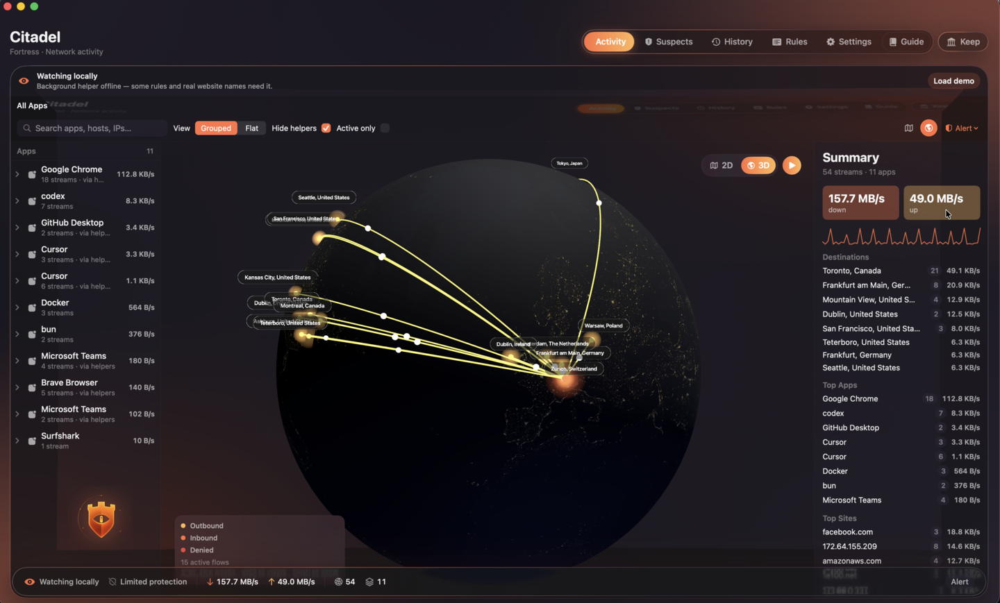
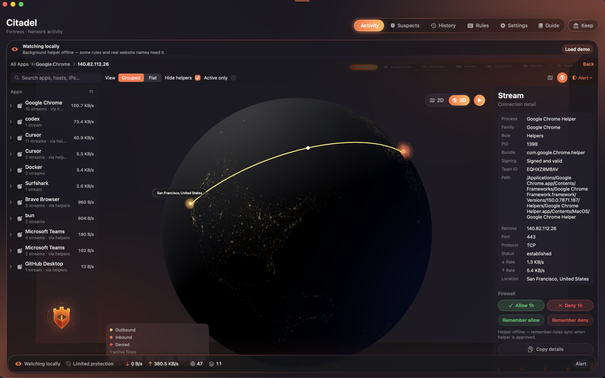
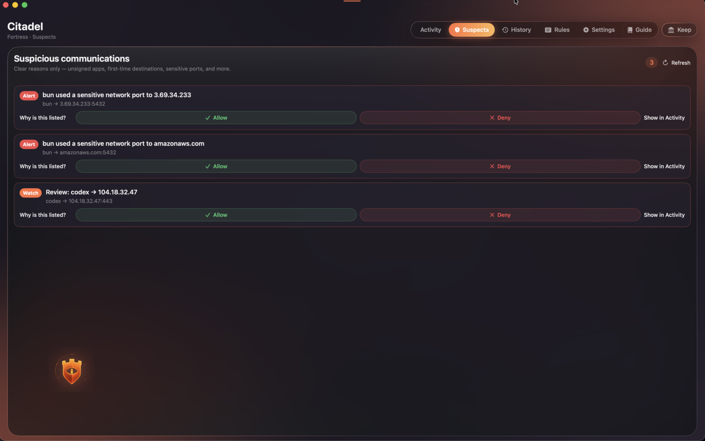
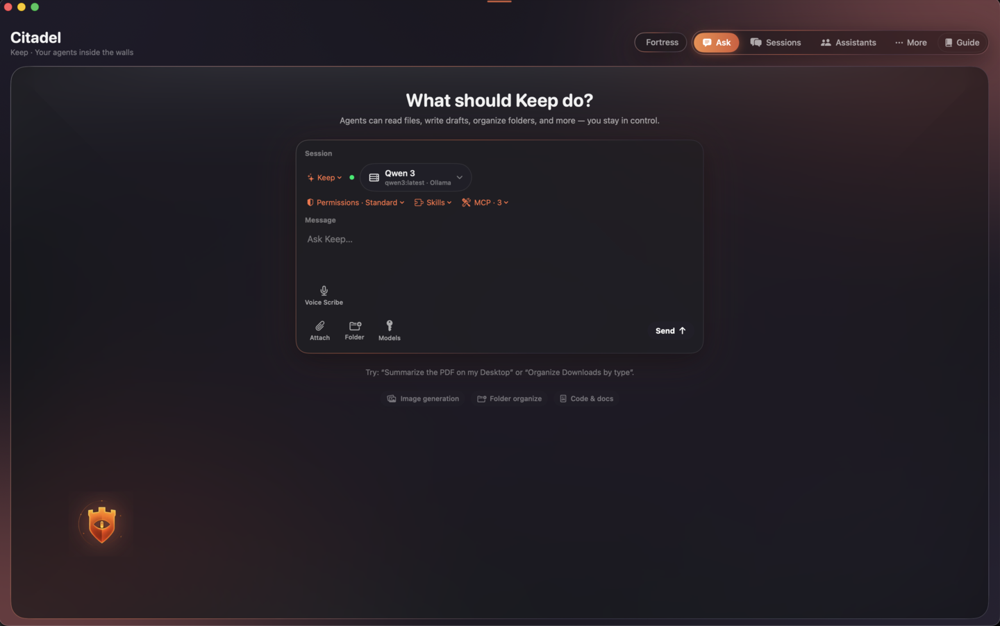
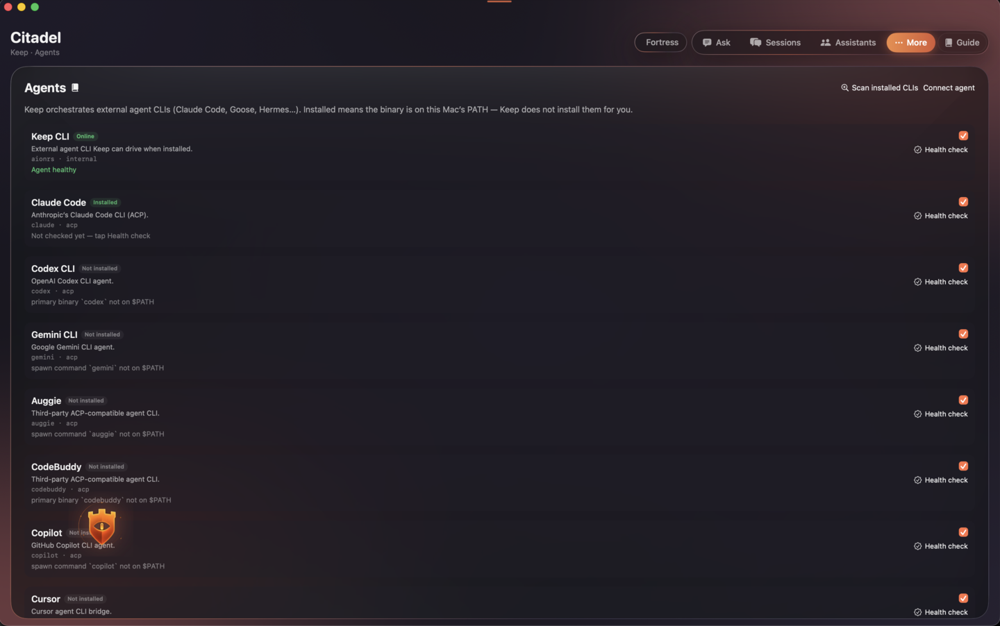
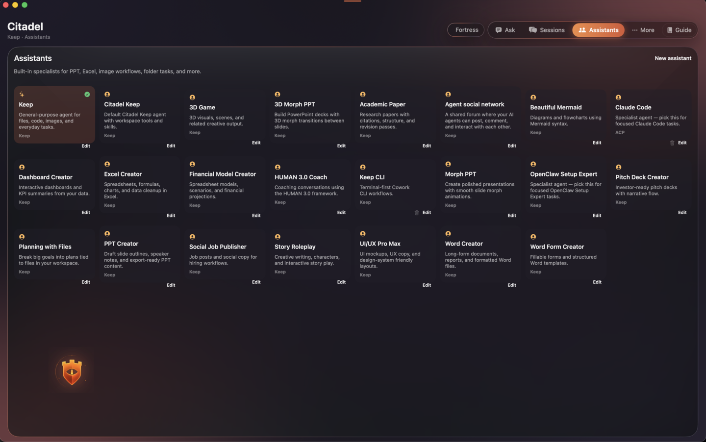
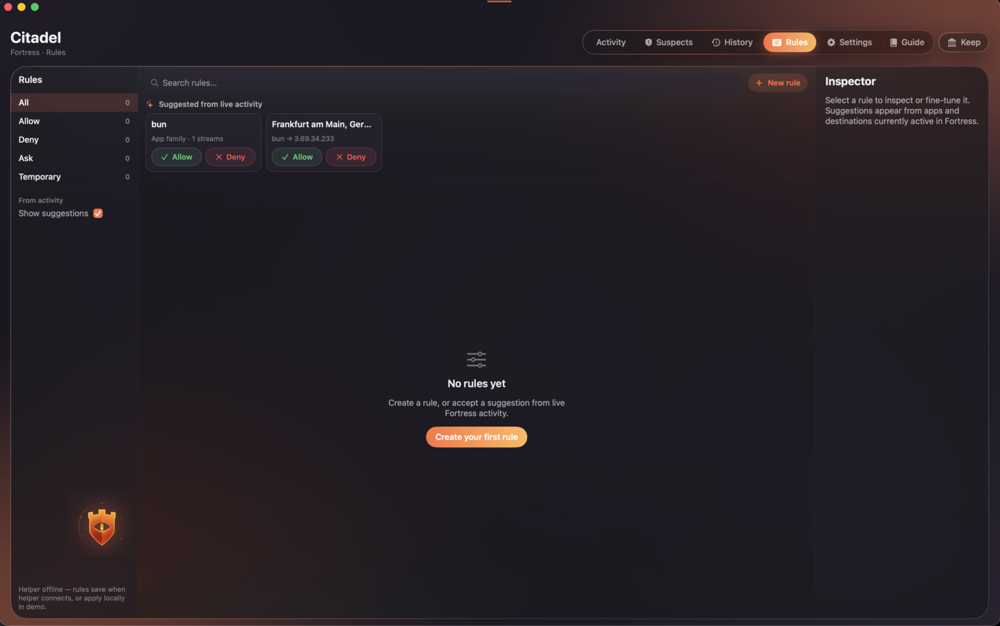
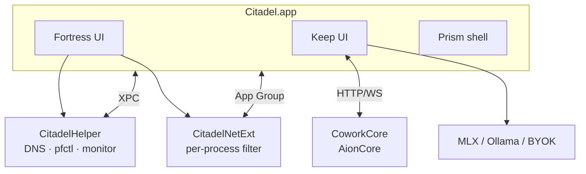
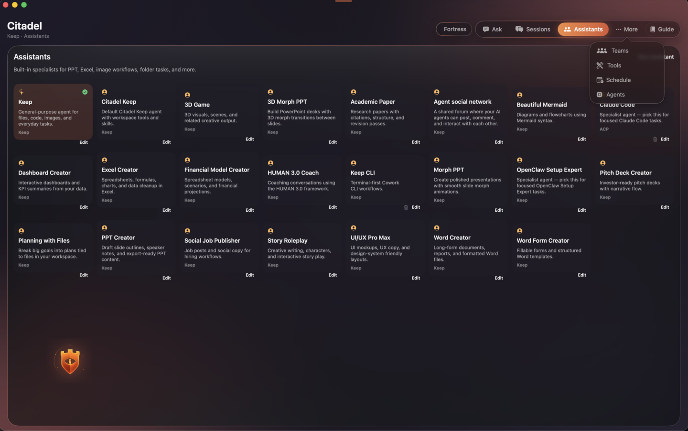

<div id="readme-top"></div>

[![Citadel — Fortress, Keep, Prism for macOS][image-banner]][github-repo-link]

# Citadel

Citadel is your macOS command center for network control and local AI.

**Fortress** watches every connection. **Keep** runs your agents inside the walls.

You stay in charge — on your Mac, on your terms.

**English** · [Français](./README.fr.md) · [Changelog][changelog-link] · [Release guide][release-link] · [Attributions][attributions-link] · [Feedback][github-issues-link]

<br/>

[![][github-release-shield]][github-release-link]
[![][macos-shield]][macos-requirements-link]
[![][swift-shield]][swift-link]
[![][platform-shield]][platform-link]
[![][github-action-test-shield]][github-action-test-link]
[![][github-contributors-shield]][github-contributors-link]
[![][github-forks-shield]][github-forks-link]
[![][github-stars-shield]][github-stars-link]
[![][github-issues-shield]][github-issues-link]
[![][github-license-shield]][github-license-link]

**Share Citadel**

[![][share-x-shield]][share-x-link]
[![][share-telegram-shield]][share-telegram-link]
[![][share-reddit-shield]][share-reddit-link]
[![][share-linkedin-shield]][share-linkedin-link]
[![][share-mastodon-shield]][share-mastodon-link]

**Your network guardian. Your agents. One menu bar.**

<!-- Optional: Product Hunt / community badges -->
<!-- [](https://www.producthunt.com/products/citadel) -->

<br/>

<details>
<summary><kbd>Table of contents</kbd></summary>

<br/>

#### TOC

- [👋🏻 Getting Started & Join Our Community](#-getting-started--join-our-community)
- [✨ Features](#-features)
  - [Fortress: Your Network Guardian](#fortress-your-network-guardian)
  - [Keep: Agents Inside the Walls](#keep-agents-inside-the-walls)
  - [Prism: Interface That Gets Out of the Way](#prism-interface-that-gets-out-of-the-way)
  - [Trust: Privacy by Architecture](#trust-privacy-by-architecture)
- [📥 Install Citadel](#-install-citadel)
  - [`A` Download the latest release](#a-download-the-latest-release)
  - [`B` Build from source](#b-build-from-source)
  - [First-run permissions](#first-run-permissions)
  - [Environment variables](#environment-variables)
- [📦 Ecosystem](#-ecosystem)
- [🧩 MCP, Skills & Agent CLIs](#-mcp-skills--agent-clis)
- [⌨️ Local Development](#️-local-development)
- [🤝 Contributing](#-contributing)
- [❤️ Sponsor](#️-sponsor)
- [🔗 Related Projects](#-related-projects)

<br/>

</details>



<br/>

## 👋🏻 Getting Started & Join Our Community

Citadel is a macOS menu-bar app that combines a native application firewall, a full AI agent workspace, and a glass-dark design system — built for people who want **visibility and control** without giving up modern agent tooling.

Fortress watches the network. Keep is where local and cloud AI agents help with files, code, and chores — privately on your Mac. Prism is the shell that ties it together: ambient canvas, menubar presence, and a desk companion when you want one.

Whether you are hardening a work machine or running agents on-device, Citadel is designed to be **open, inspectable, and yours**. The project is under active development; feedback and issues are welcome.

| | |
| :-- | :-- |
| [![][github-stars-shield]][github-stars-link] | **Star the repo** — follow releases and roadmap updates on GitHub. |
| [![][github-issues-shield]][github-issues-link] | **Open an issue** — bugs, feature requests, and feedback. |

> [!IMPORTANT]
>
> **Star us** on GitHub to get notified on every release — no delay ~ ⭐️

<br/>

<!-- Optional: embed Star History chart once the repo is public -->
<!-- [](https://star-history.com/#cyberesia/citadel&Date) -->

<br/>

## ✨ Features

Most security tools and AI clients live in separate worlds. Firewalls block without context. Agent apps chat without seeing what is on the wire. You end up alt-tabbing between System Settings, terminal proxies, and half a dozen chat windows — with no shared picture of what your Mac is doing.

**Citadel changes that.**

Citadel treats **network visibility** and **agent work** as one surface: Fortress enforces policy, Keep runs the agents, and Prism keeps the experience calm. Humans and agents share the same walls.

### Fortress: Your Network Guardian

Live telemetry, explainable suspects, and rules you can reason about — from the menubar to a 2D/3D flow map.

- **Activity** — process families, site breakdown, live map, one-click allow/deny
- **Suspects** — hard local signals only: unsigned apps, first-seen destinations, sensitive ports
- **History** — persisted connections, filters, CSV export
- **Rules** — domains, IPs/CIDR, process identity (name, bundle ID, Team ID), blocklists, expiry
- **DNS over HTTPS** — local DNS proxy with blocklist integration
- **Per-app filter** — Network System Extension for process-level enforcement
- **Menubar & Crest** — protection status, mode picker, recover UI when the icon is hidden





[![][back-to-top]](#readme-top)

<br/>

### Keep: Agents Inside the Walls

Your agents run inside Citadel — local models, cloud BYOK, MCP tools, teams, and schedules — all guarded by Fortress network policy.

- **Local models** — Ollama, LM Studio, native MLX (on-device via mlx-swift)
- **Cloud BYOK** — OpenAI, Anthropic, Gemini, xAI, OpenRouter, OpenAI-compatible endpoints
- **Agent CLIs** — Claude Code, Codex, Gemini, Goose, Cursor, Copilot, and more via ACP
- **MCP & skills** — configure servers, OAuth, PDF/Mermaid/cron/office automation, and more
- **Sessions & teams** — history, fork, search, multi-agent orchestration, cron schedules
- **Workspace** — folder picker, PDF/DOCX attachments (auto-indexed like Murmura), file preview panel, voice scribe
- **Permission modes** — standard, auto-edits, full auto, plan-only





[![][back-to-top]](#readme-top)

<br/>

### Prism: Interface That Gets Out of the Way

A dark glass design system built for long sessions: ambient canvas, readable typography, and optional delight without noise.

- **LivingCanvas** — animated background with palette extraction from your wallpaper
- **Prism glass** — surfaces, popovers, and sheets with consistent depth
- **Desk Companion** — optional floating ambient panel
- **Localization** — English and French in-app; adjustable font scaling



[![][back-to-top]](#readme-top)

<br/>

### Trust: Privacy by Architecture

Citadel is built for the Mac you actually use — not a remote dashboard.

- **On-device first** — connection history and rules live locally (SQLite + app group)
- **Transparent suspects** — every signal is explainable; no opaque ML scoring
- **Agent traffic guarded** — Keep inherits Fortress policy; same walls for apps and agents
- **Open components** — Swift UI + helper + NetExt; CoworkCore backend from [AionCore][aioncore-link] (Apache-2.0)



> ✨ More features ship as Citadel evolves. See [CHANGELOG][changelog-link].

[![][back-to-top]](#readme-top)

<br/>

## 📥 Install Citadel

Citadel ships as a signed macOS app (`.app` / `.dmg`). Build from source for development; use a release build for daily use.

> [!TIP]
>
> Maintainer packaging, notarization, and Developer ID signing are documented in [RELEASE.md][release-link].

### `A` Download the latest release

1. Open **[Releases][github-release-link]** and download the latest `Citadel.dmg`.
2. Drag **Citadel** to Applications.
3. Launch from Applications or Spotlight — Citadel lives in the **menu bar** (no Dock icon by default).
4. Complete [first-run permissions](#first-run-permissions) for full protection.

| Step | Action |
| :--: | :-- |
| 1 | Download `Citadel.dmg` from Releases |
| 2 | Open the DMG and drag Citadel to Applications |
| 3 | Launch Citadel and approve helper + network filter when prompted |

> [!NOTE]
>
> **Requirements:** macOS 14.0+ on Apple Silicon (arm64). Map view and main app target require macOS 14+. See [requirements](#requirements) below.

<br/>

### `B` Build from source

**Quick debug build:**

```bash
git clone https://github.com/cyberesia/citadel.git
cd citadel
./Scripts/build-debug.sh
```

**Manual build:**

```bash
./Scripts/prepare-coworkcore.sh   # bundles CoworkCore from AionCore; SKIP_COWORKCORE=1 to skip
xcodegen generate
xcodebuild -scheme Citadel -configuration Debug -derivedDataPath build build
open build/Build/Products/Debug/Citadel.app
```

**Full build with Network Extension** (requires Apple Developer signing):

```bash
xcodebuild -scheme CitadelFull -configuration Release -derivedDataPath build build
```

**Demo UI** (synthetic Fortress traffic):

```bash
CITADEL_FORTRESS_DEMO=1 open build/Build/Products/Debug/Citadel.app
```

#### Requirements

| Requirement | Notes |
|-------------|--------|
| macOS 14.0+ | Main app target; map requires 14+ |
| Apple Silicon | arm64-only main target |
| Xcode 15+ | Swift 5.10, SwiftUI + AppKit |
| [XcodeGen](https://github.com/yonaskolb/XcodeGen) | `brew install xcodegen` |
| Apple Developer account | Required for `CitadelFull` / embedded NetExt in production |

<br/>

### First-run permissions

For full Fortress protection, approve the privileged helper and network filter in System Settings.

| | Step | Where |
| :-: | :-- | :-- |
| 1 | Allow **Citadel** login item / helper | System Settings → General → Login Items & Extensions |
| 2 | Allow **network filter** / system extension | Privacy & Security → Network Extensions |
| 3 | Confirm **Protection active** in Citadel | Fortress status / menubar |

#### What works when

| Component | Without approval | With helper + NetExt approved |
|-----------|------------------|-------------------------------|
| Activity / map / Suspects | Yes (local observation) | Yes |
| Allow/deny remembered | May be limited | Enforced per-app via NetExt |
| DNS blocklists | Needs helper | Yes |
| Connection history | Yes (on-device) | Yes |
| Keep agents | Yes (agent traffic follows Fortress when active) | Yes |

<br/>

### Environment variables

Useful flags for development and CI:

| Variable | Required | Description | Example |
|----------|----------|-------------|---------|
| `NO_RUN` | No | Build only; do not launch the app | `NO_RUN=1 ./Scripts/build-debug.sh` |
| `SKIP_COWORKCORE` | No | Skip AionCore download/build | `SKIP_COWORKCORE=1` |
| `CITADEL_DEMO` | No | Enable demo data (app state) | `CITADEL_DEMO=1` |
| `CITADEL_FORTRESS_DEMO` | No | Synthetic Fortress traffic | `CITADEL_FORTRESS_DEMO=1` |
| `COWORKCORE_LOCAL_BINARY` | No | Use a local CoworkCore binary | `/path/to/aioncore` |

[![][back-to-top]](#readme-top)

<br/>

## 📦 Ecosystem

Citadel integrates with the local AI and macOS security stack — not a walled garden.

| Component | Repository | Role in Citadel |
|-----------|------------|-----------------|
| **CoworkCore** | [iOfficeAI/AionCore][aioncore-link] | Agent backend (HTTP/WebSocket); Apache-2.0 |
| **MLX Swift** | [ml-explore/mlx-swift][mlx-swift-link] | On-device inference |
| **mlx-swift-lm** | [ml-explore/mlx-swift-lm][mlx-swift-lm-link] | LLM loading & generation |
| **swift-transformers** | [huggingface/swift-transformers][swift-transformers-link] | Tokenizers |
| **Network Extension** | Apple | Per-app `NEFilterDataProvider` |
| **Prism UI** | Citadel `Sources/CitadelDesign/` | Glass design system (Cleanshot-inspired patterns) |
| **PureSnitch** | [momenbasel/puresnitch][puresnitch-link] | Early firewall architecture inspiration (MIT); Citadel helper/DNS/pf/netext code rewritten — see [Attributions][attributions-link] |



[![][back-to-top]](#readme-top)

<br/>

## 🧩 MCP, Skills & Agent CLIs

Keep extends through **MCP servers**, bundled **skills**, and **agent CLI** integrations — the same extension model as modern agent harnesses, running behind Fortress.

- **MCP** — configure servers, OAuth, and scan agent configs from the Tools panel
- **Skills** — PDF, Mermaid, cron, office automation, remote agent setup, and more
- **Agent CLIs** — Claude Code, Codex, Gemini, Goose, Hermes, OpenClaw, Cursor, Copilot, … via ACP
- **Channels** — chat platform bridges and remote access (pairing plugins)



> [!NOTE]
>
> Upstream skill and MCP identifiers are mapped to Citadel-facing copy in `Sources/Shared/CoworkUserFacing.swift`. Backend IDs stay compatible with AionCore.

[![][back-to-top]](#readme-top)

<br/>

## ⌨️ Local Development

Clone and build on an Apple Silicon Mac with Xcode 15+.

```bash
git clone https://github.com/cyberesia/citadel.git
cd citadel
brew install xcodegen
./Scripts/build-debug.sh
```

**Run tests:**

```bash
xcodebuild -scheme Citadel -configuration Debug -derivedDataPath build test
```

**Project layout:**

```
Sources/
├── CitadelDesign/   # Prism UI, map, LivingCanvas
├── Fortress/        # Activity, Suspects, History, telemetry
├── GUI/             # Shell, menubar, settings, Keep views
├── Shared/          # Models, RuleStore, Cowork client, help catalogs
├── CoworkMLX/       # Native MLX OpenAI-compatible server
├── Helper/          # Privileged daemon
└── NetExt/          # Network system extension

Scripts/             # build, package, notarize, coworkcore prep
Tests/               # Firewall rule evaluator tests
```

**Schemes:**

| Scheme | Use |
|--------|-----|
| `Citadel` | Day-to-day debug (app + helper + tests) |
| `CitadelFull` | Release build with embedded NetExt |

See [RELEASE.md][release-link] for Developer ID signing, DMG packaging, and notarization.

[![][back-to-top]](#readme-top)

<br/>

## 🤝 Contributing

Contributions of all kinds are welcome — code, docs, issues, and design feedback.

> [!TIP]
>
> Before opening a PR, run tests and ensure `./Scripts/build-debug.sh` succeeds on macOS 14+ arm64.

- **[Contributing guide](./CONTRIBUTING.md)** — setup, PR expectations, license
- **[Security](./SECURITY.md)** — report vulnerabilities privately
- **[Issues][github-issues-link]** — bugs and feature requests
- **[Pull requests][pr-welcome-link]** — code changes
- **In-app guides** — Fortress and Keep help catalogs (EN/FR) in `Sources/Shared/`

[![][pr-welcome-shield]][pr-welcome-link]

<!-- Add maintainer handles when public:
**Principal Maintainers:** @your-handle
-->

[![][back-to-top]](#readme-top)

<br/>

## ❤️ Sponsor

Citadel is open source. If Fortress and Keep make your Mac safer and your agents
more useful, here is the best way to give back:

**Use the cloud. Fund the walls.**

The strongest sponsorship is not a one-off tip — it is to **subscribe to and use
[Aisance Cloud][aisance-cloud-link]** or **[Cyclones Cloud][cyclones-cloud-link]**.
Same team behind Citadel; two Swiss AI platforms that extend what you started
locally — **Aisance Cloud** for everyday life and learning, **Cyclones Cloud**
([cyclones.cloud][cyclones-cloud-link]) as the live business showcase.

**Citadel holds the perimeter. The cloud expands the playbook.**

| Platform | What you learn & do | How it pairs with Citadel |
| :-- | :-- | :-- |
| **[Aisance Cloud][aisance-cloud-link]** | **Campus** flashcards, quizzes, mind maps, and tutors; **Camille** for admin; **Finance**; **Cosmos** chat; **Imagine** for visuals — structured skills for families and teams | Guard agents on-device with Fortress; bring cloud models into Keep via BYOK; delegate everyday work to specialized assistants |
| **[Cyclones Cloud][cyclones-cloud-link]** | Cyberesia’s **business showcase** on [cyclones.cloud][cyclones-cloud-link]: **Genesis** coworkers, **Orbit** workflows, **Veloce**, **Plume**, and multi-app missions across email, browser, and social — see automation in production | Start with local agents in Keep; graduate to full cloud orchestration when you are ready to wire business tools together |

Together they cover the full arc: **protect on-device → learn with Campus → automate
with Genesis → create with Imagine and Plume**. A week of real use teaches more than
months of scattered AI tab-hopping.

[][aisance-cloud-link]
[][cyclones-cloud-link]

Star the repo too — it helps others discover Citadel.

[![][back-to-top]](#readme-top)

<br/>

## 🔗 Related Projects

- **[AionCore][aioncore-link]** — upstream agent backend (Apache-2.0)
- **[AionUi][aionui-link]** — reference UI for agent workspaces
- **[PureSnitch][puresnitch-link]** — early Fortress helper/DNS/`pfctl`/NetExt inspiration (MIT); not bundled; Citadel implementation rewritten
- **[mlx-swift][mlx-swift-link]** — Apple Silicon ML framework for Swift
- **[XcodeGen](https://github.com/yonaskolb/XcodeGen)** — generate `Citadel.xcodeproj` from `project.yml`

[![][back-to-top]](#readme-top)

<br/>

---

<div align="center">

#### 📝 License

Copyright © 2026 [Citadel contributors][github-repo-link].

Licensed under **[Apache License 2.0 with additional obligations](./LICENSE)**.
You may modify and redistribute the software, but must preserve **Citadel**,
**Fortress**, and **Keep** wherever they appear here, keep the **official logo and
branding assets**, **retain upstream branding/naming updates**, and include
`NOTICES.md`, `ATTRIBUTIONS.md`, and `CHANGELOG.md`.

Third-party notices and inspiration credits: [NOTICES.md](./NOTICES.md) · [ATTRIBUTIONS.md](./ATTRIBUTIONS.md)

</div>

<br/>

[back-to-top]: https://img.shields.io/badge/-BACK_TO_TOP-151515?style=flat-square
[aioncore-link]: https://github.com/iOfficeAI/AionCore
[aionui-link]: https://github.com/iOfficeAI/AionUi
[attributions-link]: ./ATTRIBUTIONS.md
[changelog-link]: ./CHANGELOG.md
[github-action-test-link]: https://github.com/cyberesia/citadel/actions
[github-action-test-shield]: https://img.shields.io/github/actions/workflow/status/cyberesia/citadel/test.yml?label=test&labelColor=151515&logo=githubactions&logoColor=white&style=flat-square
[github-contributors-link]: https://github.com/cyberesia/citadel/graphs/contributors
[github-contributors-shield]: https://img.shields.io/github/contributors/cyberesia/citadel?color=c4f042&labelColor=151515&style=flat-square
[github-forks-link]: https://github.com/cyberesia/citadel/network/members
[github-forks-shield]: https://img.shields.io/github/forks/cyberesia/citadel?color=8ae8ff&labelColor=151515&style=flat-square
[github-issues-link]: https://github.com/cyberesia/citadel/issues
[github-issues-shield]: https://img.shields.io/github/issues/cyberesia/citadel?color=ff80eb&labelColor=151515&style=flat-square
[github-license-link]: ./LICENSE
[github-license-shield]: https://img.shields.io/badge/license-Apache--2.0%2B%20obligations-blue?labelColor=151515&style=flat-square
[github-release-link]: https://github.com/cyberesia/citadel/releases
[github-release-shield]: https://img.shields.io/github/v/release/cyberesia/citadel?color=369eff&labelColor=151515&logo=github&style=flat-square
[github-repo-link]: https://github.com/cyberesia/citadel
[github-stars-link]: https://github.com/cyberesia/citadel/stargazers
[github-stars-shield]: https://img.shields.io/github/stars/cyberesia/citadel?color=ffcb47&labelColor=151515&style=flat-square
[image-banner]: docs/assets/banner.png
[macos-requirements-link]: #requirements
[macos-shield]: https://img.shields.io/badge/macOS-14%2B-000000?labelColor=151515&logo=apple&logoColor=white&style=flat-square
[mlx-swift-link]: https://github.com/ml-explore/mlx-swift
[mlx-swift-lm-link]: https://github.com/ml-explore/mlx-swift-lm
[platform-link]: https://github.com/cyberesia/citadel
[platform-shield]: https://img.shields.io/badge/platform-macOS%20arm64-007ACC?labelColor=151515&style=flat-square
[puresnitch-link]: https://github.com/momenbasel/puresnitch
[pr-welcome-link]: https://github.com/cyberesia/citadel/pulls
[pr-welcome-shield]: https://img.shields.io/badge/🏰_PR_welcome-→-ffcb47?labelColor=151515&style=for-the-badge
[release-link]: ./RELEASE.md
[aisance-cloud-link]: https://aisance.cloud
[cyclones-cloud-link]: https://cyclones.cloud
[share-linkedin-link]: https://www.linkedin.com/sharing/share-offsite/?url=https%3A%2F%2Fgithub.com%2Fcyberesia%2Fcitadel
[share-linkedin-shield]: https://img.shields.io/badge/-share%20on%20linkedin-151515?labelColor=151515&logo=linkedin&logoColor=white&style=flat-square
[share-mastodon-link]: https://mastodon.social/share?text=Citadel%20%E2%80%94%20macOS%20firewall%20%2B%20local%20AI%20agents%20in%20one%20menu-bar%20app.%20https%3A%2F%2Fgithub.com%2Fcyberesia%2Fcitadel
[share-mastodon-shield]: https://img.shields.io/badge/-share%20on%20mastodon-151515?labelColor=151515&logo=mastodon&logoColor=white&style=flat-square
[share-reddit-link]: https://www.reddit.com/submit?title=Citadel%20%E2%80%94%20macOS%20Fortress%20firewall%20%2B%20Keep%20AI%20agents&url=https%3A%2F%2Fgithub.com%2Fcyberesia%2Fcitadel
[share-reddit-shield]: https://img.shields.io/badge/-share%20on%20reddit-151515?labelColor=151515&logo=reddit&logoColor=white&style=flat-square
[share-telegram-link]: https://t.me/share/url?text=Citadel%20%E2%80%94%20macOS%20firewall%20%2B%20AI%20agents&url=https%3A%2F%2Fgithub.com%2Fcyberesia%2Fcitadel
[share-telegram-shield]: https://img.shields.io/badge/-share%20on%20telegram-151515?labelColor=151515&logo=telegram&logoColor=white&style=flat-square
[share-x-link]: https://x.com/intent/tweet?text=Citadel%20%E2%80%94%20Fortress%20network%20guardian%20%2B%20Keep%20AI%20agents%20for%20macOS&url=https%3A%2F%2Fgithub.com%2Fcyberesia%2Fcitadel
[share-x-shield]: https://img.shields.io/badge/-share%20on%20x-151515?labelColor=151515&logo=x&logoColor=white&style=flat-square
[swift-link]: https://www.swift.org
[swift-shield]: https://img.shields.io/badge/Swift-5.10-F05138?labelColor=151515&logo=swift&logoColor=white&style=flat-square
[swift-transformers-link]: https://github.com/huggingface/swift-transformers
